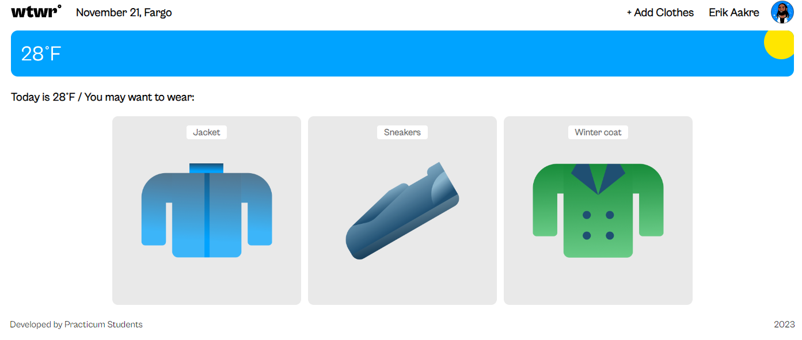
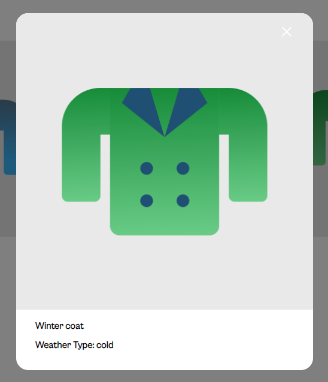
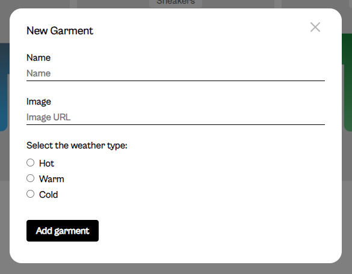

# Link to Back-End for this project

[WTWR back-end](https://github.com/eaakre/se_project_express)

## WTWR

[WTWR Site prior to back-end implementation](https://eaakre.github.io/se_project_react)

## Description of the project

This project was designed to help you figure out "What to Wear". It will fetch the weather at the set location (currently Fargo, ND), and filter all clothing items based on the weather type.

## Technologies used

This project uses React.js as well as HTML and CSS to dynamically advise you on what to wear.

## Screenshots

